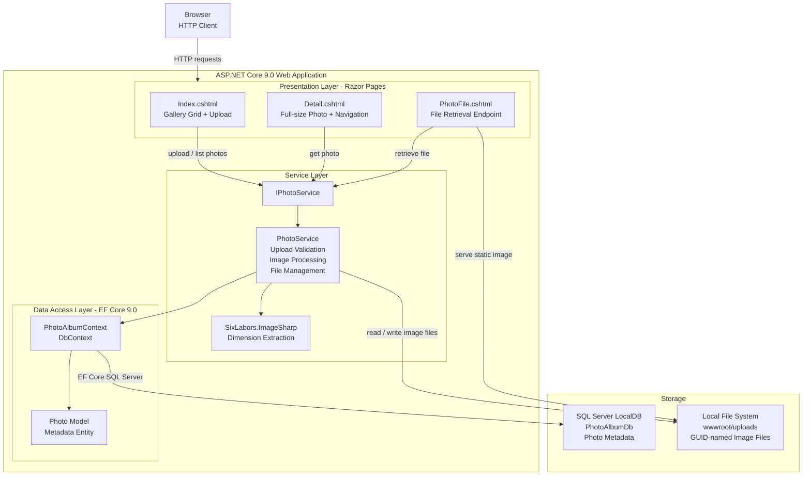

# Architecture Diagram

PhotoAlbum is an ASP.NET Core 9.0 Razor Pages web application for photo gallery management, using Entity Framework Core with SQL Server for metadata and local file storage for image files.

## Application Architecture

