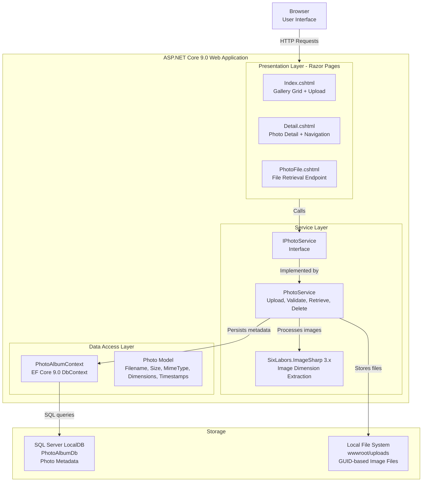

# Architecture Diagram

PhotoAlbum is an ASP.NET Core 9.0 Razor Pages web application for photo gallery management, using Entity Framework Core with SQL Server and local file system storage.

## Application Architecture

